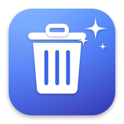
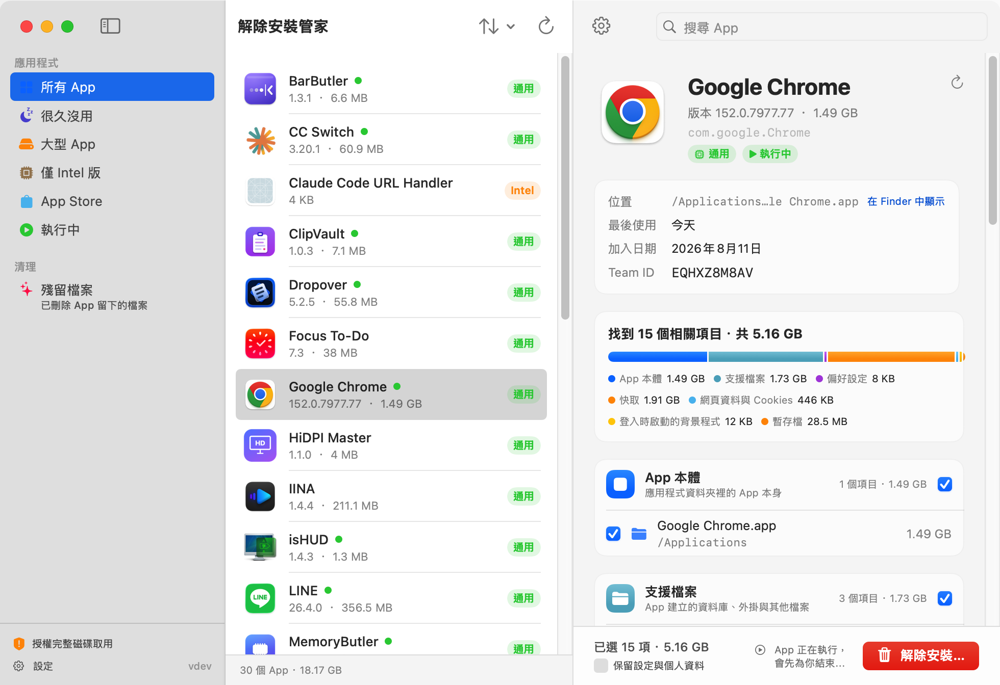

<div align="center">



# 解除安裝管家 Uninstall Butler

**細心又徹底的 Mac 解除安裝工具 —— 找出 App 留在系統各處的每一個檔案，一次清乾淨。**

[English](README.md) | **繁體中文** | [简体中文](README.zh-CN.md)




</div>

---

## 為什麼需要它

把 App 拖進垃圾桶，只是刪掉了 App 本身；它的偏好設定、快取、支援檔案、沙盒容器、背景程式、安裝收據……全都還留在系統裡，日積月累就是好幾 GB。解除安裝管家會把這些全部找出來，清楚告訴你找到什麼、為什麼判定屬於這個 App，然後一次移除。

## 功能

- 🔍 **真正徹底的掃描** —— 針對每個 App 檢查 `~/Library` 與 `/Library` 底下 40 多個位置：Application Support、偏好設定（含 ByHost）、快取、沙盒容器、群組容器、視窗狀態、HTTPStorages / WebKit / Cookies、日誌、崩潰紀錄、LaunchAgents、LaunchDaemons、特權輔助工具、`pkgutil` 安裝收據、Quick Look / Spotlight / 音訊外掛、Application Scripts、最近文件清單、`/usr/local/bin` 指令列捷徑，以及使用者專屬的 `/var/folders` 快取與暫存資料夾
- 🎯 **精準歸屬，不靠猜** —— 依 bundle ID 比對（主程式加上每一個內嵌的輔助程式、XPC、延伸功能與特權工具）、依程式碼簽章的宣告（App Groups、Team ID）、依指向 App 內部的 launchd plist、依指向 App 的 symlink、依沙盒容器的中繼資料。名稱比對只當作退路並清楚標示；兩個已安裝 App 同名時一律不用名稱比對
- 🛡 **知道什麼是共用的** —— 同開發者其他 App 也在用的群組容器、多個 App 都內嵌的輔助程式（Office、Google 更新器……）會標示「也被這些 App 使用」並預設不勾選；若這是該開發者在你 Mac 上唯一的 App，它的共用更新器會一併列出並標示「同開發者」
- ✨ **殘留檔案掃描** —— 找出很久以前刪掉的 App 留下的檔案（以反向網域命名、卻沒有任何已安裝 App、外掛、輸入法、背景服務或 Launch Services 認領），分成「可放心移除」與「請先確認」
- 🧹 **乾淨的移除流程** —— 先結束 App 與其輔助程式、卸載登入啟動項（`launchctl bootout`）、把所有項目移到垃圾桶（或永久刪除）、清除安裝收據、順手移除變空的廠商資料夾。系統層級的項目只需輸入一次管理員密碼
- 🧭 **智慧清單** —— 很久沒用、大型 App、僅 Intel 版（Rosetta）、App Store、執行中；可依名稱、大小、最後使用、加入日期排序；每個 App 都標示架構（通用 / Intel / Apple 晶片）
- 👐 **以人為本的介面** —— 每個項目都顯示路徑、大小與「為什麼算它的」；「保留設定與個人資料」開關方便重新安裝；滑鼠停留有白話說明；多選 App 可批次解除安裝
- 🔒 **從設計上就安全** —— 硬性的路徑白名單，已知的 Library / 應用程式 / 收據位置以外的東西絕對碰不到，根目錄本身永遠不會被刪；受 SIP 保護的 App 顯示鎖頭。預設移到垃圾桶，全部可復原
- 🌐 **三語介面** —— 繁體中文、简体中文、English，App 內即時切換
- 🚀 **通用二進位檔** —— Intel 與 Apple 晶片原生執行，macOS 13 Ventura 以上，約 5 MB，無相依套件，資料不會離開你的 Mac

## 安裝

1. 從最新 Release 下載 `UninstallButler.dmg`
2. 把 **Uninstall Butler** 拖進「應用程式」
3. 第一次開啟：**在 App 上按右鍵 → 打開**（未經 Apple 公證，Gatekeeper 會問一次）
4. 建議授權「**完整磁碟取用**」（系統設定 → 隱私權與安全性），管家才能連 Cookies 與容器中繼資料等受保護的資料夾一起檢查。不授權也能用，只是略少一點

## 比對原理

| 依據 | 範例 | 把握度 |
| --- | --- | --- |
| App 或其內嵌輔助程式的 bundle ID | `~/Library/Preferences/com.google.Chrome.plist`、`~/Library/Containers/com.microsoft.Word.widgetextension` | 高 |
| launchd plist 的執行檔位於 App 內 | `~/Library/LaunchAgents/…` → `/Applications/Foo.app/Contents/MacOS/agent` | 高 |
| 簽章宣告的 App Group / Team ID | `~/Library/Group Containers/UBF8T346G9.Office` | 高，共用時會標示 |
| 沙盒容器中繼資料指向 App | `~/Library/Containers/LINE.AudioService` | 高（需完整磁碟取用） |
| 指向 App 的 symlink | `/usr/local/bin/code` | 高 |
| 廠商資料夾 + 產品名 | `~/Library/Application Support/Google/Chrome` | 高 |
| 開發者前綴（該開發者唯一的 App 時） | `~/Library/LaunchAgents/com.google.keystone.agent.plist` | 標示「同開發者」 |
| 純名稱 | `~/Library/Logs/Spotify` | 標示「僅依名稱比對」 |

若另一個已安裝的 App 有「更長」的 bundle ID 前綴符合（Chrome 與 Chrome Canary），該項目會歸給那個 App。

## 從原始碼建置

只需要 Command Line Tools（不需要 Xcode）：

```bash
git clone https://github.com/xiewei3536/UninstallButler.git
cd UninstallButler
./build.sh            # → dist/UninstallButler.app 與 dist/UninstallButler.dmg（通用）
```

開發用鉤子（以下都不會刪除任何檔案）：

```bash
UNINSTALLBUTLER_SELFTEST=1 UNINSTALLBUTLER_SELFTEST_APP="Google Chrome" .build/debug/UninstallButler
UNINSTALLBUTLER_SNAPSHOT=/tmp/ub.png UNINSTALLBUTLER_LANG=zh-Hant .build/debug/UninstallButler
UNINSTALLBUTLER_DRYRUN=1 .build/debug/UninstallButler     # 完整介面，但移除只是模擬
swift test                                                # 單元測試（需要 Xcode 的 XCTest）
```

## 授權

MIT
